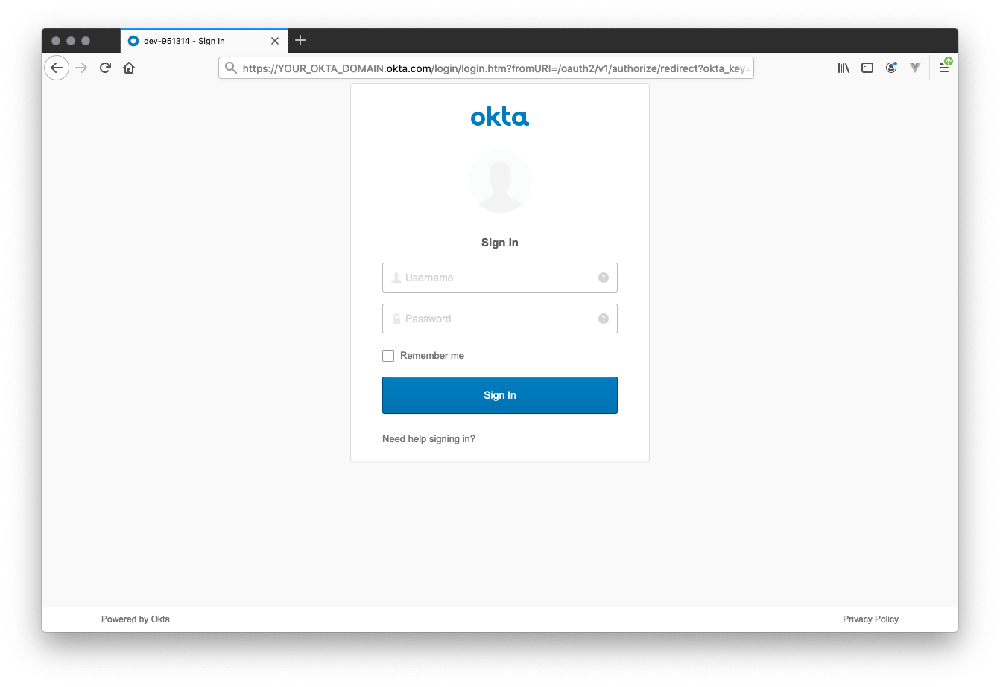
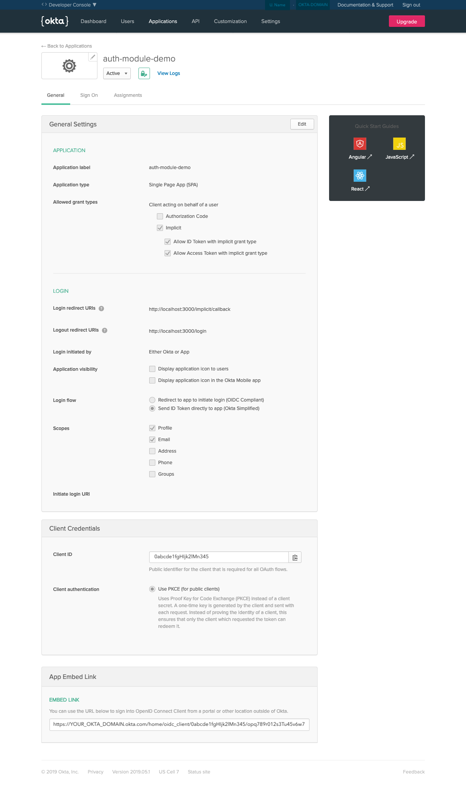

# Okta Provider

[Source Code](https://github.com/nuxt-community/auth-module/blob/dev/lib/providers/okta.js)

## IMPORTANT NOTES:

1. This Okta Provider is designed to use the ["implicit flow"](https://oauth.net/2/grant-types/implicit/) and to always redirect to Okta.com for login and logout.

2. Okta defaults to `/implicit/callback` instead of `callback`, so you _MUST_ ensure that you _EITHER_ have a corresponding callback component (i.e. `pages/implicit/callback.vue`) _OR_ that you change your Okta settings (Applications >> \<app\> >> General >> Logout redirect URIs).

## Usage

It is recommended to populate the below values with environment variables.

```js
    auth: {
      redirect: {
        callback: '/implicit/callback', // optional, defaults to '/implicit/callback'
        logout: '/',
      },
      strategies: {
        okta: {
          url: 'okta.com', // optional, defaults to okta.com
          domain: 'domain', // assigned okta domain, exclude 'okta.com'
          client_id: '...', // okta provided client id
          server_id: 'default' // optional, okta provided server id, defaults to 'default'
          scope: 'openid profile email', // optional, defaults to openid profile email
        }
      }
    }
```

## 4. Initialize your vuex store

Simply ensure you have a `store' directory.

## 5. Somewhere in your application logic:

Setup your middleware (https://auth.nuxtjs.org/guide/middleware.html) and add your login, logout, etc.

```js
this.$auth.loginWith('okta')
```

E.g. `<button @click="$auth.loginWith('okta')">Login</button>`

Upon selecting the Okta login, the user will be redirected to a page like this:




## Obtaining/setting Client Id, Domain, Audience, Authorization Server ID, and redirect urls

Your application needs some details about this client to communicate with Okta, and Okta needs some values set to ensure correct functionality with this module.

- `auth.strategies.okta.domain` and `auth.strategies.okta.client_id` are **REQUIRED** and **ARE SET BY OKTA**.
- `auth.redirect.callback` and `auth.redirect.logout` **MUST MATCH YOUR OKTA SETTINGS** and there must be a corresponding Nuxt `page`.
  - In both cases, the full url must be set in Okta (e.g. a "Logout Redirect URLs" for `http://localhost:3000/login`) while only the url path (e.g. `/login`) must be set in the nuxt.config.js' `auth.redirect` section.
  - Okta and the auth-nuxt okta provider both provide a default callback value of `implicit/callback`.  Therefore there must be a page `implicit/callback.vue` *_OR_* both the Okta and nuxt.config.js settings need to be changed to reflect the desired callback page.
  - Okta does *_NOT_* provide a default logout redirect, therefore it *_MUST_* be set or users will get an error on logout.  This module provides a default logout redirect value of `/`.
- `auth.strategies.okta.url` is optional and defaults to `okta.com`.
- `auth.strategies.okta.server_id` is optional and defaults to `default`.
- `auth.strategies.okta.scope` is optional and defaults to `'openid profile email'`.

You can access your `auth.strategies.okta.server_id` value via:  
your Okta admin site >> "API" tab >> the "Authorization Servers" tab

You can access or set your `auth.strategies.okta.domain`, `auth.strategies.okta.client_id`, `auth.redirect.callback`, `auth.redirect.logout`, and `auth.strategies.okta.scope` values via:  
your Okta admin site >> "Applications" tab >> your specific application's "General" sub-tab


